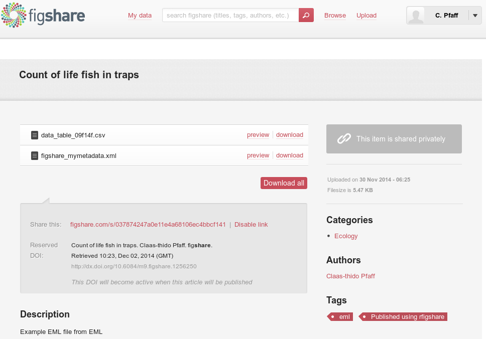

```{r load_requirements, include=F, eval=T}
require("EML")
require("knitr")
```

## Why metadata matters?

<p>   </p>

* You are interested in salmon species
  + Distribution across N.A.
  + ~ past 30 years
  + Only find publications (no datasets)
  + You ask the authors and your network

<p>   </p>

> He Claas
> 
> A former colleague of mine was working intensly with salmon  
> species in North America over years. He is retired now but we  
> still have his data laying around in our archive. I hope this     
> is useful to you!  
> -- *All the best Karl*

<a href="assets/files/csv_file_from_email.csv" class="btn"><i class="icon-envelope"></i> Attachment.csv</a>

---

## Why metadata matters?

```{r nometadata, include = F}
river = c("SAC",  "SAC",   "AM")
spp   = c("king",  "king", "ccho")
stg   = c("smolt", "parr", "smolt")
ct    = c(293,    410,    210)
dates = c("1991-10-10", "1992-11-10", "1993-10-10")
undescribed_data = data.frame(river, spp, stg, ct, dates)
```

<p>   </p>

```{r nometadatashow, echo = F, results = 'asis', cache=FALSE}
kable(undescribed_data)
```

<p>   </p>

* These you guess:
  - river: Abbr. of collection sites (full name)
  - spp: Abbr. of species names (full name)
  - stg: The life stage of fish

* But what about the rest/details?
  - ct: Is numeric (Measured, Statistics, Method)
  - dates: Which date format? (YMD, YDM)

---

## Why metadata matters?

</br>

<p>   </p>

* You ask and get the answer:

<p>   </p>

> He Claas
> 
> I just checked the data again and fortunately I was involved  
> in that particular data collection! The information you need is:  
>
> river: sac = The sacramento river, am = The american river  
> spp: king = King Salmon, ccho = Coho Salmon  
> stg: par = Third life stage, smolt = Fourth life stage  
> ct: It is the count of life fish caught in traps  
> dates: The date format is YMD
>  
> -- *All the best Karl*

<p>   </p>

* With that information you can start use the data!

---

## Why metadata matters?

* We learn: 
  - Without proper metadata
  - data unusalbe and lost

<p>   </p>

* Metadata standards (DwC, EML)

<p>   </p>

* Ecological Metadata Language (EML, XML)
  * Allows to capture aspects of data:
    * Units and categories
    * Temporal and spatial coverage ...
    * Contact information ... and much more
  * In a structured machine readable way
 
<div class = "flushfooter">
  <a href="https://knb.ecoinformatics.org/#tools" class="btn"><i class="icon-home"></i> Morpho</a>
  <a href="http://dataup.cdlib.org/" class="btn"><i class="icon-home"></i> Data-Up</a>
  <a href="http://bit.ly/1vuYJTt" class="btn"><i class="icon-book"></i> Fegraus et al. 2005</a>
  <a href="https://github.com/befdata/befdata" class="btn"><i class="icon-download"></i> BEF-Data</a>
</div>

---

## The package (About)

* Metadata tools
  - Morpho (DataOne, KNB)
  - Metacat (DataOne, KNB)
  - Data-Up (Californian Libraries)
  - BEF-Data (BEF-China)
  - EML for R (initial commit 24 Jun 2013)

* Motivation (R package for EML)
  * Many data undescribed; Biologists in R
  * Introduces a wide spread standard to R
  * Read + Write metadata
  * Publish (Data + Metadata)

<div class = "flushfooter">
  <a href="https://knb.ecoinformatics.org/#tools" class="btn"><i class="icon-home"></i> EML</a>
</div>

---

## The package (About)

* Part of the rOpenSci community
  * Data-Acess, Vizualisation, Reproducibility... 30+)
  * rgbif (Global Biodiversity Information Facility)
  * taxize (20+ Taxonomic Databases for e.g. species name resolving) 
  * rBEFdata (Access to BEFdata data management platforms)
  
* The EML package is developed by:


<a href="http://ropensci.org/" class="btn flushfooter"><i class="icon-home"></i> rOpenSci</a>

--- bg:#EEE

## The package (Install)

<p>   </p>

* Not yet available via CRAN
* Source code via GitHub
  * https://github.com/ropensci/EML

<p>   </p>

* Devtools (Hadley Wickham)
  
```
install.packages("devtools")
library("devtools")
```

<p>   </p>

* Install from github

```
install_github("ropensci/EML", build=FALSE, dependencies=c("DEPENDS", "IMPORTS"))
library("EML")
```

<a href="assets/files/install_script.R" class="btn flushfooter"><i class="icon-download"></i> Install Script.R</a>

---

## Typical metadata

```
- eml
  - dataset
    - creator (o)
    - contact (o)
    - publisher
    - title (o)
    - pubDate
    - keywords
    - abstract
    - intellectualRights (o)
    - methods
    - coverage
    - dataTable (o)
      - physical
      - attributeList
  - additionalMetadata
``` 

---

## Typical metadata (add core)

```
- eml
  - dataset
    - creator (o)
    - contact (o)
    - publisher
    - title (o)
    - pubDate
    - keywords
    - abstract
    - intellectualRights (o)
    - methods
    - coverage
    - dataTable (x, descr., cats., units)
      - physical
      - attributeList
  - additionalMetadata
```

---

## Create metadata

* River site used for collection
  - river: sac = The sacramento river, am = The american river  
* Scientific species names  
  - spp: king = King Salmon, ccho = Coho Salmon
* Life stage of fish
  - stg: par = Third life stage, smolt = Fourth life stage  
* Count of life fish in traps
  - ct: numeric  
* The date of data collection: 
  - dates: Format is Day, Month, Year

<p>  </p>

<a href="assets/files/csv_file_from_email.csv" class="btn flushfooter"><i class="icon-envelope"></i> Attachment.csv</a>

---

## Create metadata

* EML package adds `data.set(data.frame, col.defs =, unit.defs =)`

* `col.defs` (plain text definition)

```{r set_column_defs}
col_defs = c("River site used for collection",
             "Species common name",
             "Life Stage",
             "Count of live fish in traps", 
             "Date of collection")
```

- `unit.defs` (factor => levels, dates => YYYY or MM-DD-YY, numeric => unit list [KNB](http://bit.ly/1vEmFnE))

```{r set_unit_defs}
unit_defs = list(c(SAC = "The Sacramento River", AM = "The American River"),
                 c(king = "King Salmon", ccho = "Coho Salmon"),
                 c(parr = "third life stage", smolt = "fourth life stage"),
                 c(unit = "number"),
                 c(format = "YYYY-MM-DD"))
```

---

## Assemble

<p>   </p>

* Assemble
  - core metadadta 
  - data 
  - with `data.set()`

```{r put_together}
described_dataset = data.set(undescribed_data,
                             col.defs = col_defs,
                             unit.defs = unit_defs)
```

<p>   </p>

* We use the variables just prepared
  - `col_defs`
  - `unit_def`

--- bg:#EEE

## Your turn (core metadata)

* Get the data 

```{r your_turn_core_metadata, eval = F}
undescribed_data = read.csv("http://bit.ly/11Q4GOt")
```

* Create the colum definitions (character vector)
  - Save to variable (e.g descriptions)

* Create unit definitions (list)
  - Save to variable (e.g units)
  - Use: unit = "number" (for the count)
  - Use: format = "YYYY-MM-DD" (for the date)
 
* Assemble (`data.set(data, col.defs = descriptions, unit.defs = units)`)
  - save to variable (e.g data_with_core_metadata)

<a href="assets/files/task_add_core_metadata.R" class="btn flushfooter"><i class="icon-download"></i> Failed? Your rescue!</a>

---

## Typical metadata (add more "x")

```
- eml
  - dataset
    - creator (x)
    - contact (o)
    - publisher
    - title (o)
    - pubDate
    - keywords
    - abstract
    - intellectualRights (o)
    - methods
    - coverage
    - dataTable (done)
      - physical
      - attributeList
  - additionalMetadata
```

---

## Objects (excursion)

* create an instance from an object

```
the_new_instance = new("contact")
```

* show all variables (slotnames)

```{r get_slots_of_contact}
getSlots("contact")
```

```
slotNames("contact")
```

---

## Objects (excursion)

* Slots can contain var. data types:
  - character
  - numeric 
  - lists
  - other objects

* Subsetting (not $ but @)

```
the_new_instance@slotname
```

* coercions 

```
as("22", "numeric")
```

---

## Add creator (name, mail)

```{r create_person}
claas = eml_person("Claas-Thido Pfaff <fake@test.com>")
```

```
new("contact", 
  individualName = new("individualName", 
                        givenName = "Claas-Thido Pfaff", 
                        surName = "Pfaff"), 
  electronicMailAddress = "fake@test.com")
```

```{r check_slotnames}
slotNames(claas)
```

---

## Add creator

```{r check_individual_name}
claas@individualName
```

```{r check_individual_name_surName}
claas@individualName@surName
```

---

## Add creator (address)

```{r inspect_address}
getSlots("address")
```

```{r add_address}
address = new("address",
              deliveryPoint = "Universität Leipzig, Johannisallee 21",
              city          = "Leipzig",
              postalCode    = "04103",
              country       = "GER")
```

```{r assign_address}
claas@address = address
```

---

## Add creator (inspect)

* Which class it that person object of?

```{r check_person}
class(claas)
```

<p>   </p>

* It is a contact not a creator!
  - Coerce it

```{r coerce_to_creator}
claas_creator = as(claas, "creator")
```

```{r assign_address_to_claas_as_well, include=F, eval=TRUE}
claas_creator@address = address
```

<p>   </p>

* Why is this important?

---

## It is important because!

* Class names and slot names
  - get fields in the EML!

```
<creator>
  <individualName>
    <givenName>Claas-Thido</givenName>
    <surName>Pfaff</surName>
  </individualName>
  <address>
    <deliveryPoint>Universität Leipzig, Johannisallee 21</deliveryPoint>
    <city>Leipzig</city>
    <postalCode>04103</postalCode>
    <country>GER</country>
  </address>
  <electronicMailAddress>fake@test.com</electronicMailAddress>
</creator>
```

--- bg:#EEE

## Your turn (add contact)

```
- eml
  - dataset
    - creator (done)
    - contact (x)
    - publisher
    - title (o)
    - pubDate
    - keywords
    - abstract
    - intellectualRights (o)
    - methods
    - coverage
    - dataTable (done)
      - physical
      - attributeList
  - additionalMetadata
```

--- bg:#EEE

## Your turn (add contact)

</br>

* Add a contact
  - Use `you = eml_person("Your Name <yourmail@provider.com>")`
* Add an address 
  - `address = new("address", deliveryPoint = "....")`
  - also add: city, postalCode, country
  - hint: `slotNames("address")`
* Do not forget to assign the address to your contact!
  - `you@address = address`

<a href="assets/files/task_add_contact_metadata.R" class="btn flushfooter"><i class="icon-download"></i> Failed? Your rescue!</a>

--- bg:#EEE

## Your turn (add contact 1)

* Convenient 
  - with `eml_person()`
  - Create address
  - Assign address

<p>   </p>

```{r name, eval=F}
myname = eml_person("J. Steidle <steidle@fake.com>")
myaddress = new("address",
              deliveryPoint = "University Hohenheim, Schloss Hohenheim 1",
              city          = "Stuttgart",
              postalCode    = "70599",
              country       = "GER")
myname@address = myaddress
```

<a href="assets/files/task_add_contact_metadata.R" class="btn flushfooter"><i class="icon-download"></i> Failed? Your rescue!</a>

--- bg:#EEE

## Your turn (add contact 2)

* More verbose
  - More basic (no wrapper function)
  - Everything in one block

```
new("contact", individualName = new("individualName", 
                                                    givenName = "Claas-Thido Pfaff", 
                                                    surName = "Pfaff"), 
               electronicMailAddress = "claas-thido.pfaff@uni-leipzig.de",
               phone = "+49-341-97-38587",
               address = new("address",
                                      deliveryPoint = "Universität Leipzig, Johannisallee 21",
                                      city = "Leipzig",
                                      postalCode = "04103",
                                      country = "GER")
```

<a href="assets/files/task_add_contact_metadata.R" class="btn flushfooter"><i class="icon-download"></i> Failed? Your rescue!</a>

---

## Typical metadata (add more "x")

```
- eml
  - dataset
    - creator (done)
    - contact (done)
    - publisher
    - title (x)
    - pubDate
    - keywords
    - abstract
    - intellectualRights (x)
    - methods
    - coverage
    - dataTable (done)
      - physical
      - attributeList
  - additionalMetadata
```

---

## Put all together

* The `eml()` command assembles

```{r assemble_eml, eval = T}
data = eml(dat = described_dataset,
           title = "Count of life fish in traps",
           contact = claas,
           creator = claas_creator,
           intellectualRights = "CC0, Creative commons zero"
           )
```

* Write out the EML to a file

```{r eval=T}
eml_write(data, file="mymetadata.xml")
```

* More often you use `.eml`

<div class = "flushfooter">
  <a href="assets/files/example_eml_from_url.xml" class="btn"><i class="icon-zoom-in"></i> EML file</a>
  <a href="assets/files/assets/files/example_csv_file.csv" class="btn"><i class="icon-zoom-in"></i> CSV file</a>
</div>

---

## Publish (curr. figshare, knb)

* Publish to figshare (requires `rfigshare` package)

```{r eval = F}
eml_publish("mymetadata.xml", 
            description="Example EML file from EML",
            categories = "Ecology", 
            tags = "EML", 
            destination="figshare")
```

```{r eval=FALSE}
Your article has been created! Your id number is 1256252
[1] 1256252
```

* Requires
  - R-Package (`rfigshare`)
  - Figshare account (http://figshare.com)

---

## Publish (curr. figshare, knb)



---

## Publish (curr. figshare, knb)


--- bg:#EEE

## Your turn (assemble/write out)

* Assemble 
  - The dataset + core metadata (you created)
  - the contact (you created)

* Add a title and usage rights

`title = "Count of life fish in traps of the sacramento and american river"`

`license = "CC0, http://creativecommons.org/publicdomain/zero/1.0"`

* Hint:
  `final = eml(dat = ..., title =, contact = ...)`
  
* Write out the metadata and data
  - Hint: eml_write(final, file = "xy.xml")

<a href="assets/files/task_write_out_metadata.R" class="btn flushfooter"><i class="icon-download"></i> Failed? Your rescue!</a>

---

## Read metadata
  
* Read metadata from any EML formated source (File, URL, KNB-ID)

```{r get_the_data}
metadata_locally = eml_read("mymetadata.xml")
```

```{r get_the_data_online}
metadata_online = eml_read("http://bit.ly/1viuNDZ")
```

<p>   </p>

* Then use `eml_get(metadata, "xy")`
  - coverage
  - contact
  - unit.defs
  - col.defs
  - creator
  - data.set ...

---

## Read metadata
  
```{r extract_creator, eval=T}
eml_get(metadata_online, "contact")
```  
  
```{r extract_coverage, eval=T}
eml_get(metadata_locally, "col.defs")
```

---

## Import data
  
```{r extract_from_local_dataset}
eml_get(metadata_locally, "data.set")
```

---

## Import data
  
* Or only the raw data

```{r extract_from_local_dataframe}
eml_get(metadata_locally, "data.frame")
```

* Note using 
  - `data.frame` not
  - `data.set` here

--- bg:#EEE

## Your turn (Read/Import)

</br>

* Import the metadata from here:
  - http://bit.ly/1yhi1b3
  - use `eml_read()`
  - Read the title (hint: use subset with `@`)
  - Extract contact (hint: `eml_get()`)

* Get the core data and metadata (hint: `eml_get()`)
  - extract the data.set 
  - Extract the data.frame

--- bg:#EEE

## Your turn (Read/Import)

```{r read_eml_from_url}
eml_from_url = eml_read("http://bit.ly/1yhi1b3")
```

```{r get_title_from_eml}
eml_from_url@dataset@title
```

```{r get_contact_information}
eml_get(eml_from_url, "contact")
```

```
eml_get(eml_from_url, "data.set")
eml_get(eml_from_url, "data.frame")
```

---

## Wrap-up

</br> 

* The `EML` package
  - Read/Write metadata
  - From any EML source
  - Describe your own data
  - Store your metadata and reuse it!
  - Publication of citable data products

* This was very brief:
  - Just visit GitHub for more!
  - https://github.com/ropensci/EML

---

<div class = "flushcenter">
  <h1>Thanks for your attention!</h1>
  <h1>Any questions?</h1>
</div>
  
<br>
 * Find this slides: 
<br>
  http://cpfaff.github.io/emlforrcourse
<br>
 * Find EML package: 
<br>
  https://github.com/ropensci/EML

