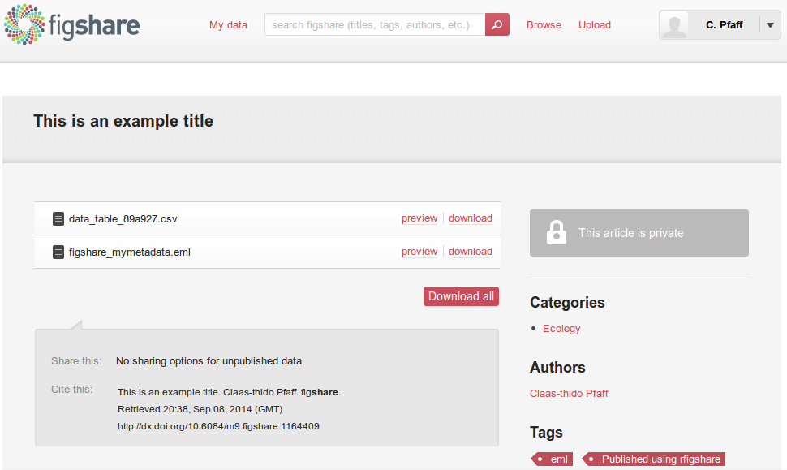
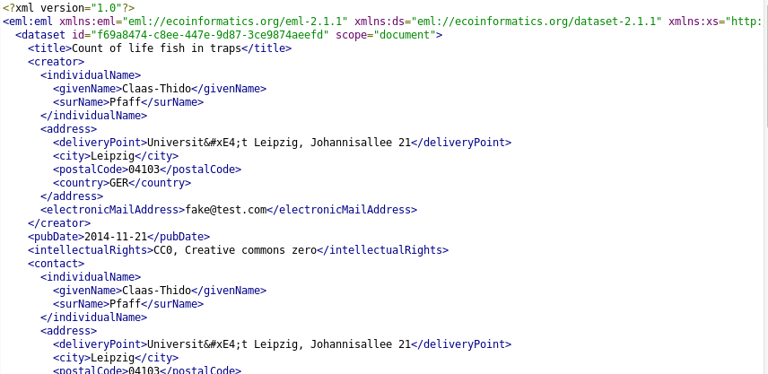
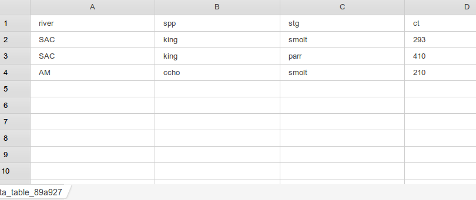

## Why metadata matters?

<p>   </p>

* You are interested in salmon species
  + Distribution across N.A.
  + ~ past 30 years
  + Only find publications (no datasets)
  + You ask the authors and your network


<p>   </p>

> He Claas
> 
> A former colleague of mine was working intensly with salmon  
> species in North America over years. He is retired now but we  
> still have his data laying around in our archive. I hope this     
> is useful to you!  
> -- *All the best Karl*

<a href="assets/files/csv_file_from_email.csv" class="btn"><i class="icon-envelope"></i> Attachment.csv</a>

---

## Why metadata matters? 


<p>   </p>


|river |spp  |stg   |  ct|dates      |
|:-----|:----|:-----|---:|:----------|
|SAC   |king |smolt | 293|1991-10-10 |
|SAC   |king |parr  | 410|1992-11-10 |
|AM    |ccho |smolt | 210|1993-10-10 |

<p>   </p>

* These you guess:
  - river: Abbr. of collection sites (full name)
  - spp: Abbr. of species names (full name)
  - stg: The life stage of fish

* But what about the rest/details?
  - ct: Is numeric (Neasured, statistic, Method)
  - dates: Which date format? (YMD, YDM)

---

## Why metadata matters?

</br> 

> He Claas
> 
> I just checked the data again and fortunately I was involved  
> in that particular data collection! The information you need is:  
>
> river: sac = The sacramento river, am = The american river  
> spp: king = King Salmon, ccho = Coho Salmon  
> stg: par = Third life stage, smolt = Fourth life stage  
> ct: It is the count of life fish caught in traps  
> dates: The date format is YMD
>  
> -- *All the best Karl*

* With that information you can start use the data!

---

## Why metadata matters?

* We learn: 
  - Without metadata
  - Data gets unusalbe and is lost
  
<p>   </p>

* Metadata standards (DwC, EML)

<p>   </p>

* Ecological Metadata Language (EML, XML)
  * Allows to capture aspects of data:
    * Units and categories
    * Temporal and spatial coverage ...
    * Contact information ... and much more
  * In a structured machine readable way
 
<div class = "flushfooter">
  <a href="https://knb.ecoinformatics.org/#tools" class="btn"><i class="icon-home"></i> Morpho</a>
  <a href="http://dataup.cdlib.org/" class="btn"><i class="icon-home"></i> Data-Up</a>
  <a href="http://bit.ly/1vuYJTt" class="btn"><i class="icon-book"></i> Fegraus et al. 2005</a>
  <a href="https://github.com/befdata/befdata" class="btn"><i class="icon-download"></i> BEF-Data</a>
</div>

---

## The package (About)

</br>

* Metadata tools
  - Morpho (companion online)
  - Metacat (companion online), Data-Up (Californian Libraries), BEF-Data (BEF-China)
  - EML for R (initial commit 24 Jun 2013)

* Motivation (R package for EML)
  * Many data undescribed; Biologists in R
  * Introduces a wide spread standard to R
  * Read + Write metadata
  * Publish (Data + Metadata)

<div class = "flushfooter">
  <a href="https://knb.ecoinformatics.org/#tools" class="btn"><i class="icon-home"></i> EML</a>
</div>

---

## The package (About)

* Part of the rOpenSci community
  * Data-Acess, Vizualisation, Reproducibility... 30+)
  * rgbif (Global Biodiversity Information Facility)
  * taxize (20+ Taxonomic Databases for e.g. species name resolving) 
  * rBEFdata (Access to BEFdata data management platforms)
  
* The EML package is developed by:


<a href="http://ropensci.org/" class="btn flushfooter"><i class="icon-home"></i> rOpenSci</a>

--- bg:#EEE

## The package (Install)

* Not yet available via CRAN
* Source code via GitHub
  * https://github.com/ropensci/EML
  
* Devtools (Hadley Wickham)
  
```
install.packages("devtools")
library("devtools")
```

* Install from github

```
install_github("ropensci/EML", build=FALSE, dependencies=c("DEPENDS", "IMPORTS"))
library("EML")
```

<a href="assets/files/install_script.R" class="btn flushfooter"><i class="icon-download"></i> Install Script.R</a>

---

## Typical metadata

```
- eml
  - dataset
    - creator
    - contact
    - publisher
    - title
    - pubDate
    - keywords
    - abstract
    - intellectualRights
    - methods
    - coverage
    - dataTable
      - physical
      - attributeList
  - additionalMetadata
``` 

---

## Typical metadata (add core)

```
- eml
  - dataset
    - creator
    - contact
    - publisher
    - title
    - pubDate
    - keywords
    - abstract
    - intellectualRights
    - methods
    - coverage
    - dataTable: descr., cats., units
      - physical
      - attributeList
  - additionalMetadata
```

---

## Create metadata

<p>  </p>

* River site used for collection
  - river: sac = The sacramento river, am = The american river  
* Scientific species names  
  - spp: king = King Salmon, ccho = Coho Salmon
* Life stage of fish
  - stg: par = Third life stage, smolt = Fourth life stage  
* Count of life fish in traps
  - ct: numeric  
* The date of data collection: 
  - dates: Format is Day, Month, Year

<a href="assets/files/csv_file_from_email.csv" class="btn flushfooter"><i class="icon-envelope"></i> Attachment.csv</a>

---

## Create metadata

* EML package adds `data.set(data.frame, col.defs =, unit.defs =)`

* `col.defs` (plain text definition)


```r
col_defs = c("River site used for collection",
             "Species common name",
             "Life Stage",
             "Count of live fish in traps", 
             "Date of collection")
```

- `unit.defs` (factor => levels, dates => YYYY or MM-DD-YY, numeric => unit list [KNB](http://bit.ly/1vEmFnE))


```r
unit_defs = list(c(SAC = "The Sacramento River", AM = "The American River"),
                 c(king = "King Salmon", ccho = "Coho Salmon"),
                 c(parr = "third life stage", smolt = "fourth life stage"),
                 unit = "number",
                 format = "YYYY-MM-DD")
```

---

## Glue together (data.set)

* Put together with `data.set()`


```r
described_dataset = data.set(undescribed_data,
                             col.defs = col_defs,
                             unit.defs = unit_defs)
```

* However there is still general information missing:
  - title (add now)
  - absract
  - temporal and spatial coverage
  - contact person (add now)
  - creator
  - and other things ...

--- bg:#EEE

## Your turn (core metadata)

* Get the data 

```
undescribed_data = read.csv("http://bit.ly/11Q4GOt")
```

* Create the colum definitions (character vector)
  - Save to variable (e.g descriptions)

* Create unit definitions (list)
  - Save to variable (e.g units)
  - Use: unit = "number" (for the count)
  - Use: format = "YYYY-MM-DD" (for thed date)
  - Ensure that the date column is a date! (`as.Date(...)`)

* Put together (`data.set(data, col.defs = descriptions, unit.defs = units)`)

<a href="assets/files/task_add_core_metadata.R" class="btn flushfooter"><i class="icon-download"></i> Failed? Your rescue!</a>

---

## Typical metadata (add more "x")

```
- eml
  - dataset
    - creator 
    - contact (x)
    - publisher
    - title
    - pubDate
    - keywords
    - abstract
    - intellectualRights
    - methods
    - coverage
    - dataTable (done)
      - physical
      - attributeList
  - additionalMetadata
```

---

## Add contact (name, mail)

* Create person


```r
claas = eml_person("Claas-Thido Pfaff <fake@test.com>")
```

* What is it?


```r
class(claas)
```

```
## [1] "contact"
## attr(,"package")
## [1] "EML"
```

```r
typeof(claas)
```

```
## [1] "S4"
```

---

## Objects (excursion)

* create an instance from an object

```
the_new_instance = new("object name")
```

* Subsetting (not $ but @)

```
the_new_instance@slotname
```

* coercions 

```
as("22", "numeric")
```

* Show all slotnames

```
slotNames(the_new_instance)
```

* Slots can contain
  - All sorts of variable types (text, numeric, lists, oter objects...)

---

## Add contact (inspect)


```r
slotNames(claas)
```

```
## [1] "individualName"        "organizationName"      "positionName"         
## [4] "address"               "phone"                 "electronicMailAddress"
## [7] "onlineUrl"             "userID"                "references"
```


```r
claas@individualName@givenName
```

```
## [1] "Claas-Thido"
```


```r
claas@individualName@surName
```

```
## [1] "Pfaff"
```

---

## Add contact (address)

* Create the address
  - create (new)


```r
address = new("address",
               deliveryPoint = "Universität Leipzig, Johannisallee 21",
               city = "Leipzig",
               postalCode = "04103",
               country = "GER")
```

</br>

* Assign to my "address" slot
  - Subset (@)


```r
claas@address = address
```

--- bg:#EEE

## Your turn (add creator)


```r
- eml
  - dataset
    - creator (x)
    - contact (done)
    - publisher
    - title 
    - pubDate
    - keywords
    - abstract
    - intellectualRights 
    - methods
    - coverage
    - dataTable (done)
      - physical
      - attributeList
  - additionalMetadata
```

--- bg:#EEE

## Your turn (add creator)

</br>

* Create a creator
  - Use `you <- eml_person("Your Name <yourmail@provider.com>")`
* Add an address 
  - address = new("address", deliveryPoint = "....")
  - also add: city, postalCode, country
* Do not forget to assign the address to your creator!
  - `you@address = address`
* Coerce the contact to a creator (save e.g. in `you_creator`)
  - `as(you, "creator")`

---

## Show the the right way

* also allow to download the solution from 
  here on then

---

## Typical metadata (add more "x")


```r
- eml
  - dataset
    - creator (done)
    - contact (done)
    - publisher
    - title (x)
    - pubDate
    - keywords
    - abstract
    - intellectualRights (x)
    - methods
    - coverage
    - dataTable (done)
      - physical
      - attributeList
  - additionalMetadata
```

---

## Add other 

*

---

## Put all together

* The `eml()` command assembles everything


```r
data <- eml(dat = described_dataset,
            title = "This is an example title",
            contact = claas_contact
            )
```

* Write out the EML to a file


```r
eml_write(data, file="mymetadata.eml")
```

* Publish to figshare (requires `rfigshare` package)


```r
eml_publish("mymetadata.eml", 
            description="Example EML file from EML",
            categories = "Ecology", 
            tags = "EML", 
            destination="figshare")
```

---

## Uploaded to FigShare



---

## Uploaded to FigShare

* Metadata



* Data




## Idea collection practice

Read data and metadata:
  + Import a dataset
  + Extract contact person
  + Extract a column description

Write data and metadata:
  + Download an example dataset
  + Add the core metadata (units: dictionary, dates, descriptions, classes)
  + Show the most common metadata fields 
  + Let them create and add (creator, contact, title, intellectual rights)


---

## Read metadata
  
* Read metadata from any EML formated source (File, URL, KNB-ID)


```r
metadata <- eml_read("http://china.befdata.biow.uni-leipzig.de/datasets/334.eml")
```

* Then use `eml_get(metadata, "xy")`
  - csv_filepaths
  - coverage
  - contact
  - unit.defs
  - col.defs
  - creator
  - data.set ...

---

## Read metadata
  

```r
eml_get(metadata, "creator")
```

```
## [1] "Anne Lang <anne_christina.lang@uni-leipzig.de> [cre]"
## [2] "Werner Härdtle <haerdtle@uni-lueneburg.de> [cre]"   
## [3] "Goddert von Oheimb <vonoheimb@uni.leuphana.de> [cre]"
```
  

```r
eml_get(metadata, "coverage")
```

```
## geographicCoverage:
##   geographicDescription: "The experiment was set up in the northeast part of Jiangxi
##     Province, P.R. China (N 29° 06.29 E 117° 55.28). \n"
##   boundingCoordinates:
##     westBoundingCoordinate: '117.89978'
##     eastBoundingCoordinate: '118.148346'
##     northBoundingCoordinate: '29.285201'
##     southBoundingCoordinate: '29.101777'
## temporalCoverage:
##   rangeOfDates:
##     beginDate:
##       calendarDate: |2
## 
##         2009-08-26
##     endDate:
##       calendarDate: |2
## 
##         2010-09-26
## taxonomicCoverage:
##   taxonomicClassification:
##     commonName: |2+
## 
##       tree species (Schima superba, Elaeoarpus decipiens, Castanea henryi, Quercus serrata)
```

---

## Import data

* Access the data based on metadata information
  


```
example_dataset = eml_get(metadata, "data.set")
```

* Just display a subset of it here


```r
example_dataset[1:4, 1:3]
```

```
##     plot_id             Spp Leaf_15N_recovery_g_T5
## 1 pilot1C09 Castanea henryi              1.504e-05
## 2 pilot1D10 Castanea henryi              8.604e-05
## 3 pilot2C11 Castanea henryi              2.905e-05
## 4 pilot2D01 Castanea henryi              8.923e-06
```

---

## Wrap-up

* The `EML` package
  - Access to metadata 
  - Access to data
  - From any EML formatted source!
  - Describe your own data with metadata
  - Allows publication of citable data products

* This was very brief intro:
  - Just visit GitHub for more!
  - https://github.com/ropensci/EML

---

<div class = "flushcenter">
  <h1>Thanks for your attention!</h1>
  <h1>Any questions?</h1>
</div>
  
<br>
 * Find this slides: 
<br>
  http://cpfaff.github.io/remlgfoe2014
<br>
 * Find EML package: 
<br>
  https://github.com/ropensci/EML


